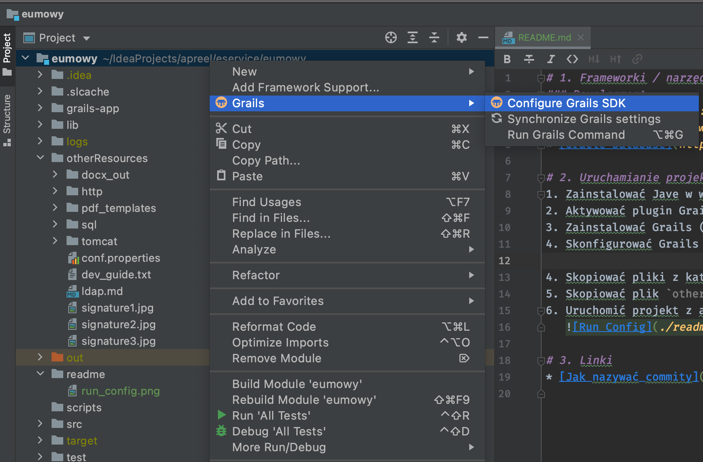
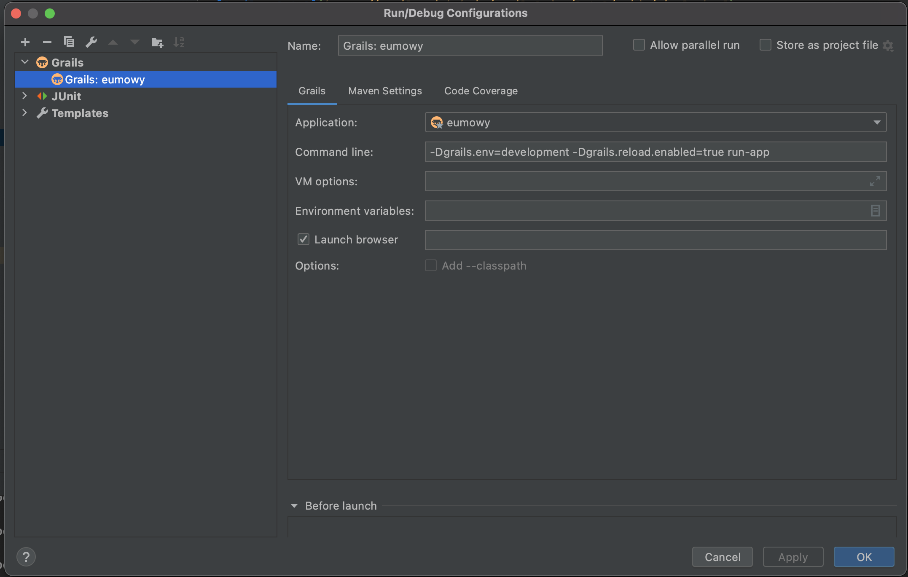

# 1. Frameworki / narzędzia

### Development

* [Grails v2.4.2](https://grails.github.io/grails2-doc/2.4.2/guide/single.html)
* [Java 1.7](https://www.oracle.com/pl/java/technologies/javase/javase7-archive-downloads.html)
* [Oracle Database](https://www.oracle.com/pl/database/)
* NodeJS + NPM

# 2. Uruchamianie projektu

1. Zainstalować Jave w wersji 1.7
2. Aktywować plugin Grails (Intellij IDEA)
3. Zainstalować Grails (najlepiej przy użyciu [SDKMAN!](https://sdkman.io))
4. Skonfigurować Grails SDK dla projektu
   
5. Skopiować pliki z katalogu `otherResources/tomcat/lib` do `$USER_HOME/.grails`
6. Skopiować plik `otherResources/conf.properties` do `/opt/settings`
7. Przekopiowac katalog `otherResources/pdf_templates` do lokalizacji `/opt/eumowy`
8. Uruchomić projekt z argumentami `-Dgrails.env=development -Dgrails.reload.enabled=true run-app`
   

# 4. Budowanie kodu frontendowego

Do projektu został wprowadzony dodatkowy katalog `js-src`. Zawiera kod frontendowy, który następnie jest wpinany do
frontendów pisanych w GSP (Grails Server Pages).

Kod pisany jest z użyciem TypeScript i budowany przy użyciu Vite.
Po wprowadzeniu zmian, należy wywołać polecenie `npm run build` z poziomu katalogu `js-src`. Spowoduje to skopiowanie
zbudowanego kodu do katalogu, z którego Grailsy zaczytują assety frontendowe.

# 3. Linki

* [Jak nazywać commity](https://seesparkbox.com/foundry/semantic_commit_messages)

# 4. Inne informacje

## Namiary na bazę danych

URL: `jdbc:oracle:thin:@10.9.192.59:1521:cbd_dev`

Username: `EUMOWY_APP`

Hasło: `Ahfopcvy$aU3`

## Konta użytkowników

| Login        | Hasło                 | Rola     |
| -----------  | --------------------- | -------- |
| askonieczny  | CzerwiecSierpien2023% | PH       |
| mmelissa     | QQww123@456@789       | Admin    |

## Przydatne zapytania SQL

* Wszystkie możliwe sygnatury dla aktywności
  ```
  SELECT act.CODE, act_sig.NUMBER_OF_LIST, sig.NAME, sig.DESCRIPTION, act_sig.REQUIRED_ACTIVITIES, act_sig.MANDATORY
  FROM ACTIVITY_SIGNATURES act_sig
     JOIN ACTIVITY act ON act_sig.ACTIVITY_ID = act.ID
     JOIN SIGNATURE sig on act_sig.SIGNATURE_ID = sig.ID
  WHERE sig.ACTIVE = 1
  ORDER BY act_sig.NUMBER_OF_LIST;
  ```

* Usunięcie powiązania sygnatury z aktywnością
  ```
  DELETE FROM EUMOWY.ACTIVITY_SIGNATURES
     WHERE ACTIVITY_ID IN (SELECT ID FROM ACTIVITY WHERE CODE IN ('dodanieDcc', 'logoKalkulatorSesja')) AND
     SIGNATURE_ID = (SELECT ID FROM SIGNATURE WHERE NAME = 'AP/UW/AWU/1.000/21-01-01') AND
     REQUIRED_ACTIVITIES = 'nowaUmowa';
  ```

* Dodanie nowego panelu do sygnatury
  ```
  INSERT INTO EUMOWY.PANEL (ID, VERSION, NAME, ORDER_NO) VALUES(EUMOWY.PANEL_SEQ.nextval, 0, 'nazwaPanelu', 485);

  INSERT INTO EUMOWY.SIGNATURE_PANEL(ID, VERSION, PANEL_ID, SIGNATURE_ID)
  VALUES (EUMOWY.SIGNATURE_PANEL_SEQ.nextval, 0, (SELECT ID FROM EUMOWY.PANEL WHERE NAME = 'nazwaPanelu'), (SELECT ID FROM EUMOWY.SIGNATURE WHERE NAME = 'virtualNowaUmowa'));
  ```

* Podmiana sygnatur
  ```
  v_syg_source := 'AP/UPZ/ZSNT1/1.004/18-07-20';
  v_syg_dest := 'AP/UPZ/ZSNT1/1.005/20-02-28';

  v_ind:= EUMOWY.EUM_HELPER.fkopiuj_sygnature(v_syg_source,v_syg_dest);
  update eumowy.signature set TEMPLATE_PATH = 'APUPZZSNT11.00520-02-28.pdf' where name = v_syg_dest;
  update eumowy.signature set active = 0 where name = v_syg_source;
  ```

* Zmiana lokalizacji podpisów na wydruku
  
  Lokalizację podpisów określa się metodą "chybił trafił" na podstawie wielokretnego wykonania testów z klasy `PdfIntegrTests.groovy` używając różnych koordynatów
  ```
  DELETE FROM eumowy.subscription_definition WHERE signature_id = (SELECT id FROM eumowy.signature WHERE name = 'AP/UPZ/ZSNT1/1.005/20-02-28');

  INSERT INTO eumowy.subscription_definition (ID, VERSION, SIGNATURE_ID, ROLE, FILE_NAME, SUBSCRIPTION_PAGE_NUMBER, SUBSCRIPTIONX, SUBSCRIPTIONY, SCALEX, SCALEY)
  VALUES ((SELECT max(id) + 1 FROM eumowy.subscription_definition), 0, (SELECT id FROM eumowy.signature WHERE name = 'AP/UPZ/ZSNT1/1.005/20-02-28'), 'PH', null, 1, 390, 382, 59, 28);
  ```

## LDAP
Aktualna dokumentacje mozna wygenerowac pod adresem
http://uat-eumowy.apreel.net:8080/microLDAP/jsondoc-ui.html#
wprowadzajac url uslugi
http://uat-eumowy.apreel.net:8080/microLDAP/jsondoc

## Wydawanie paczki
Na Jenkinsie stworzony jest [task do releasowania nowych wersji](http://jenkins.apreel.net/job/eService/job/eumowy%20release/).
Przy wydawaniu należy uruchomić dwa zadania jako prefix podając numer wersji większy od parametru `app.version` z pliku `application.properties`, 
a jako sufix podać parametry - `uat` i `prod` (dla każdego zadania inny).
Przykładowo jeżeli obecny `app.version` to `1.15.1` to należy stworzyć dwa zadania w Jenkinsie - w jednym podać w `releaseVersion` `1.15.2-uat`, a w drugim `1.15.2-prod`.

Po zbudowaniu paczek należy uruchomić [taska do kopiowania zbudowanych paczek](http://jenkins.apreel.net/job/eService/job/eumowy%20copy%20package/) na serwer eService. 
Podobnie jak przy releasie należy stworzyć dwa zadania. 
Jako targetSystem podajemy środowisko UAT, a w `releaseVersion` wpisujemy paczki zbudowane w poprzednim kroku (czyli np. `1.15.2-uat` i `1.15.2-prod`).

Po zakończeniu zadań należy napisać maila do [Mariusza Adwenta](Mariusz.Adwent@eservice.com.pl) i [Małgorzaty Melissy](malgorzata.melissa@eservice.com.pl) 
z informacją o tym, że nowa paczka znajduje się na ich serwerze.

# Road to refactoring

1. Change documentation to english
2. All new code (variables etc.) uses english language
3. All existing code should slowly be changed to english
3. Rename "signatures" to "document number" within "document template"
   - Right now, word "signature" confuses people with signatures people put on documents
   - Rename "subscriptions" to "signatures"
4. Document templates should be configured using config file in a well known format (for example YAML)
   - Currently, they are configured using a database, which makes it harder to have a reproducible setup between environments
   - Having the configuration in a database makes it harder to test and validate/review changes
   - Business doesn't edit that configuration themselves
5. Each document template should be versioned and have it's dedicated mapper class
   - Right now mapping form data to documents happens using conventions which are hard to follow, remember and maintain
   - It also makes it harder to test mappings
6. Each panel should have its own command class encapsulating data gathered from given panel]
   - Right now a lot of state lives in a big ProcessCommand
7. Each panel should have its own Panel JS component encapsulating its frontend logic
   - This will make it easier to migrate that logic to some frontend library in the future (like React or Angular)
   - Easier to test and isolate changes, faster to find and fix bugs + this gives us better separation between GSP and JS
8. Move all custom JS code from GSP files to `js-src` project
9. Reintroduce types gradually to make refactorings and code editing safer and let compiler be our friend in catching bugs
10. Write code in Java whenever possible. Rewrite Groovy code into Java code when possible.
   - Follow ideas from hexagonal/ports & adapters architecture, where most of the business code is written in typed Java
     and it is plugged into the Grails framework
   - This should make it easier to migrate out of Grails framework to something else in the future and make the code less
     dependent on the framework infrastructure.
11. Introduce Flyway to manage DB schema and migrations
12. Introduce more value objects to represent business concepts and make the source code more type safe
13. Improve local development experience:
    - add docker compose with dev database
    - add fakes & mocks for external services
